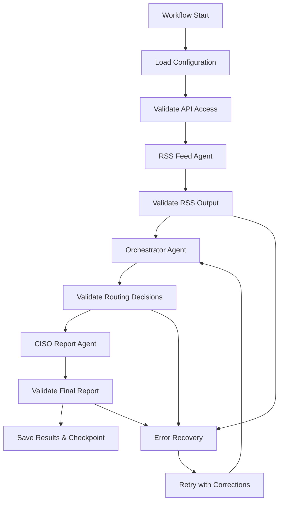

# NOMAD Framework - Direct Agent Execution Implementation

This document describes the implementation of direct agent execution capabilities for the NOMAD Threat Intelligence Framework.

## 🎯 What Was Implemented

The NOMAD framework now supports **both** Claude Code orchestration (original design) and **direct Python execution** (new capability).

### Core Changes

#### 1. LLM Integration (`src/agents/base_agent.py`)
- **Real Claude API Integration**: The `process_with_llm()` method now makes actual API calls to Claude
- **Prompt Processing**: Automatically formats prompt templates with input data
- **Response Parsing**: Handles both JSON and text responses from Claude
- **Error Handling**: Retry logic with exponential backoff for API failures
- **Environment Loading**: Automatic detection of ANTHROPIC_API_KEY

#### 2. Environment Configuration (`src/config/environment.py`)
- **Centralized Config**: Single place for all environment variables
- **API Key Management**: Secure handling of multiple API keys
- **Directory Management**: Automatic creation of required directories
- **Validation**: Checks for required environment variables

#### 3. Direct Execution Scripts (`scripts/`)
Created standalone executable scripts for each agent:

- **`run_rss_agent.py`**: Direct RSS feed processing with LLM enhancement
- **`run_orchestrator.py`**: Intelligence routing and decision making
- **`run_ciso_report.py`**: Executive report generation

Each script includes:
- Command-line argument parsing
- Multiple output formats (JSON, table, summary)
- Verbose logging options
- Dry-run capabilities
- Error handling and recovery

#### 4. Enhanced Workflow Runner (`nomad_workflow_enhanced.py`)
- **Dual Mode Support**: Both Claude Code and direct execution
- **Automated Chaining**: Passes output files between agents
- **Error Recovery**: Handles timeouts, API errors, validation failures
- **Progress Tracking**: Real-time status updates during execution
- **Checkpointing**: Saves intermediate results for debugging

#### 5. Workflow Validation (`src/utils/workflow_validator.py`)
- **Input Validation**: Ensures agent inputs meet schema requirements
- **Output Validation**: Verifies agent outputs are properly structured
- **Error Recovery**: Automatic fixes for common data issues
- **Checkpoint System**: Workflow state preservation and recovery

## 🚀 How to Use Direct Execution

### Prerequisites

1. **Environment Setup**:
   ```bash
   # Copy and configure environment
   cp .env.example .env
   # Edit .env and add your ANTHROPIC_API_KEY
   ```

2. **Install Dependencies**:
   ```bash
   pip install -r requirements.txt
   ```

### Usage Examples

#### List Available Workflows
```bash
python nomad_workflow_enhanced.py list
```

#### Generate Execution Plan
```bash
# For Claude Code orchestration
python nomad_workflow_enhanced.py plan morning_check --mode=claude_code

# For direct execution
python nomad_workflow_enhanced.py plan morning_check --mode=direct
```

#### Execute Complete Workflow
```bash
# Automated execution with error recovery
python nomad_workflow_enhanced.py execute morning_check
```

#### Run Individual Agents
```bash
# RSS Feed Agent
python scripts/run_rss_agent.py --priority high --use-llm --format summary

# Orchestrator (requires RSS output)
python scripts/run_orchestrator.py --input data/output/rss_feed_result_*.json --format table

# CISO Report (requires orchestrator output)
python scripts/run_ciso_report.py --decisions data/output/orchestrator_result_*.json --format executive
```

## 🛠 Technical Architecture

### Execution Flow



### Error Recovery Strategies

1. **API Errors**: Retry with exponential backoff, fallback to cached data
2. **Timeouts**: Reduce batch sizes, implement chunking
3. **Validation Errors**: Auto-fix common issues, provide corrected data
4. **Rate Limits**: Intelligent backoff, queue management

### Data Flow

1. **RSS Agent** → JSON file with intelligence items
2. **Orchestrator** → JSON file with routing decisions
3. **CISO Report** → JSON/Markdown executive report

Each step validates inputs, processes with Claude API, validates outputs, and creates checkpoints.

## 🔧 Configuration Files

### Environment Variables (`.env`)
```bash
ANTHROPIC_API_KEY=your_api_key_here
LOG_LEVEL=INFO
OUTPUT_DIR=data/output
ORG_NAME=Your Organization
CROWN_JEWELS=Exchange,Active Directory,Database
```

### Workflow Configuration (`config/claude_agent_config.yaml`)
```yaml
workflows:
  morning_check:
    name: "Morning Security Check"
    steps:
      - agent: rss_feed
        config:
          priority: high
          since: "24 hours ago"
      - agent: orchestrator
      - agent: ciso_report
```

## 🧪 Testing

### Generate Sample Data
```bash
# Create test routing decisions
python scripts/run_ciso_report.py --template

# Test single RSS feed
python scripts/run_rss_agent.py --single-feed https://feeds.feedburner.com/TheHackersNews --use-llm
```

### Dry Run Mode
```bash
# See what would be executed without API calls
python scripts/run_rss_agent.py --priority high --dry-run
python nomad_workflow_enhanced.py plan morning_check --mode=direct
```

## 📊 Monitoring and Logging

### Output Files
- **Results**: `data/output/` - JSON outputs from each agent
- **Logs**: `data/logs/` - Recovery attempts and error logs
- **Checkpoints**: `data/checkpoints/` - Workflow state snapshots
- **Cache**: `data/cache/` - API response caching (if enabled)

### Log Levels
- **DEBUG**: Detailed API calls and data processing
- **INFO**: High-level progress and completion status
- **WARNING**: Non-fatal issues and recovery attempts
- **ERROR**: Failures requiring attention

## 🔮 Future Enhancements

### Planned Features
1. **Multiple LLM Support**: OpenAI GPT integration alongside Claude
2. **Advanced Caching**: Redis-backed response caching
3. **Parallel Processing**: Concurrent agent execution for large datasets
4. **Web Interface**: Dashboard for workflow monitoring
5. **Alert Integration**: Webhook support for real-time notifications

### Performance Optimizations
1. **Batch Processing**: Handle large RSS feeds efficiently
2. **Incremental Updates**: Only process new intelligence items
3. **Smart Caching**: Context-aware response caching
4. **Resource Pooling**: Connection reuse for API calls

## 🤝 Integration with Claude Code

The framework maintains full compatibility with Claude Code's Task tool system:

```python
# Claude Code can still use the original orchestration approach
Task(
    description="RSS Feed Agent",
    prompt=open("rss-agent-prompt.md").read(),
    subagent_type="general-purpose"
)
```

Both execution modes share the same prompt templates, ensuring consistency between Claude Code orchestration and direct Python execution.

## ✅ Benefits of Direct Execution

1. **Debugging**: Step-by-step execution with detailed logging
2. **Recovery**: Automatic error handling and retry logic
3. **Testing**: Dry-run mode and individual agent testing
4. **Monitoring**: Real-time progress tracking and metrics
5. **Automation**: Scriptable workflows for CI/CD integration
6. **Performance**: Optimized API usage and response caching

The implementation provides a robust foundation for both interactive development (Claude Code) and production automation (direct execution).