# NOMAD Documentation Hub

Welcome to the complete documentation for NOMAD (Notable Object Monitoring And Analysis Director) - the AI-powered threat intelligence orchestration framework.

## 🚀 Getting Started

**New to NOMAD?** Start here:

- **[📖 Quick Start Guide](user-guide/quick-start.md)** - Get up and running in 10 minutes
- **[⚙️ Configuration Guide](user-guide/configuration.md)** - Configure NOMAD for your organization
- **[🔧 Troubleshooting Guide](user-guide/troubleshooting.md)** - Fix common issues

## 📚 Documentation Sections

### 👥 User Documentation

Perfect for security professionals, SOC analysts, and administrators:

| Document | Description | Audience |
|----------|-------------|----------|
| [📖 Quick Start Guide](user-guide/quick-start.md) | Get NOMAD running in 10 minutes | Everyone |
| [📘 User Manual](user-guide/user-manual.md) | Complete feature guide and usage | End Users |
| [⚙️ Configuration Guide](user-guide/configuration.md) | Customize NOMAD for your environment | Administrators |
| [🔄 Workflow Guide](user-guide/workflows.md) | Create and manage custom workflows | Power Users |
| [🆘 Troubleshooting Guide](user-guide/troubleshooting.md) | Diagnose and fix common issues | Everyone |

### 💻 Developer Documentation

Essential for developers, integrators, and contributors:

| Document | Description | Audience |
|----------|-------------|----------|
| [🏗️ Developer Setup](developer-guide/setup.md) | Development environment setup | Developers |
| [🏛️ Architecture Overview](developer-guide/architecture.md) | System design and components | Developers |
| [🔧 Agent Development](developer-guide/agent-development.md) | Create custom agents | Developers |
| [🧪 Testing Guide](developer-guide/testing.md) | Testing practices and tools | Developers |
| [🚀 Deployment Guide](developer-guide/deployment.md) | Production deployment | DevOps |

### 📖 Reference Documentation

Detailed technical references:

| Document | Description | When to Use |
|----------|-------------|-------------|
| [🔌 API Documentation](reference/api.md) | REST APIs and integrations | Building integrations |
| [📋 Schema Reference](reference/schemas.md) | Data formats and validation | Data processing |
| [🎭 Prompt Engineering](reference/prompts.md) | AI prompt templates | Customizing AI behavior |
| [🔒 Security Guide](reference/security.md) | Security best practices | Production deployment |
| [⚡ Performance Guide](reference/performance.md) | Optimization and tuning | High-volume environments |

### 📝 Examples and Tutorials

Practical examples and use cases:

| Document | Description | Use Case |
|----------|-------------|----------|
| [🎯 Basic Usage Examples](examples/basic-usage.md) | Common usage patterns | Learning the system |
| [🚀 Advanced Workflows](examples/advanced-workflows.md) | Complex workflow examples | Power users |
| [🔧 Custom Agent Examples](examples/custom-agents.md) | Building new agents | Extending the system |

## 📊 NOMAD at a Glance

### What NOMAD Does

NOMAD is a comprehensive threat intelligence framework that:

- **🔍 Collects** threats from 100+ RSS feeds, vendor advisories, and security bulletins
- **🧠 Analyzes** using Claude AI to prioritize and contextualize threats
- **🎯 Routes** intelligence to appropriate teams (SOC, Vuln Management, IT Ops)
- **📊 Reports** executive summaries for leadership decision-making

### Key Features

- **AI-Powered Analysis**: Uses Anthropic Claude for intelligent threat assessment
- **Automated Routing**: Policy-based routing to appropriate teams with SLA tracking
- **Flexible Execution**: Both interactive (Claude Code) and automated (CLI) workflows
- **Standardized Output**: Consistent data formats for integration and reporting
- **Enterprise Ready**: Security, auditing, and compliance features built-in

### Architecture Overview

```mermaid
graph LR
    A[RSS Feeds] --> B[RSS Agent]
    B --> C[Orchestrator]
    C --> D[Claude AI]
    C --> E[Technical Alerts]
    C --> F[CISO Reports]
    C --> G[Watchlist]
```



## 🎯 Quick Navigation by Role

### 👔 Security Leadership
- [📊 Executive Overview](#nomad-at-a-glance)
- [📘 User Manual - Executive Reports](user-guide/user-manual.md#ciso-report-agent)
- [⚙️ Configuration - Organization Settings](user-guide/configuration.md#organization-settings)
- [📈 Performance Guide](reference/performance.md)

### 🛡️ SOC Analysts
- [📖 Quick Start Guide](user-guide/quick-start.md)
- [📘 User Manual - Technical Alerts](user-guide/user-manual.md#technical-alert-agent)
- [🔄 Workflow Guide - Daily Operations](user-guide/workflows.md#daily-security-operations)
- [🆘 Troubleshooting Guide](user-guide/troubleshooting.md)

### 🔧 Vulnerability Management
- [📘 User Manual - Vulnerability Focus](user-guide/user-manual.md#vulnerability-management)
- [🔄 Workflow Guide - Patch Management](user-guide/workflows.md#vulnerability-management)
- [⚙️ Configuration - Risk Settings](user-guide/configuration.md#risk-tolerance-configuration)

### 💻 Developers & Integrators
- [🏗️ Developer Setup](developer-guide/setup.md)
- [🏛️ Architecture Overview](developer-guide/architecture.md)
- [🔧 Agent Development](developer-guide/agent-development.md)
- [🔌 API Documentation](reference/api.md)

### ⚙️ System Administrators
- [⚙️ Configuration Guide](user-guide/configuration.md)
- [🚀 Deployment Guide](developer-guide/deployment.md)
- [🔒 Security Guide](reference/security.md)
- [🆘 Troubleshooting Guide](user-guide/troubleshooting.md)

## 🏃‍♂️ Common Tasks

### Getting Started
1. [📖 Read Quick Start Guide](user-guide/quick-start.md)
2. [⚙️ Configure your environment](user-guide/configuration.md#environment-configuration)
3. [🚀 Run your first workflow](user-guide/quick-start.md#your-first-threat-intelligence-run)

### Daily Operations
1. [🌅 Morning security check](user-guide/workflows.md#morning-check-workflow)
2. [📊 Review technical alerts](user-guide/user-manual.md#technical-alert-agent)
3. [🔍 Investigate high-priority threats](user-guide/workflows.md#incident-response-workflow)

### Weekly Reporting
1. [📈 Generate CISO report](user-guide/workflows.md#weekly-report-workflow)
2. [📊 Analyze metrics and trends](user-guide/user-manual.md#ciso-report-agent)
3. [🔧 Tune workflow parameters](user-guide/configuration.md#performance-tuning)

### Development & Customization
1. [🏗️ Set up development environment](developer-guide/setup.md)
2. [🔧 Create custom agents](developer-guide/agent-development.md)
3. [🔄 Design custom workflows](user-guide/workflows.md#creating-custom-workflows)

## 🔧 Configuration Quick Reference

### Essential Environment Variables
```bash
ANTHROPIC_API_KEY=your_api_key_here
ORG_NAME=Your Organization
CROWN_JEWELS=Exchange,Active Directory,Database
BUSINESS_SECTORS=Financial Services,Healthcare
```

### Core Commands
```bash
# List available workflows
python nomad_workflow_enhanced.py list

# Execute morning check
python nomad_workflow_enhanced.py execute morning_check

# Generate CISO report
python scripts/run_ciso_report.py --week-start 2025-09-07 --week-end 2025-09-13

# Test RSS collection
python scripts/run_rss_agent.py --priority high --use-llm --format summary
```

## 🆘 Getting Help

### Quick Help
- **Common Issues**: [Troubleshooting Guide](user-guide/troubleshooting.md)
- **Configuration Problems**: [Configuration Guide](user-guide/configuration.md)
- **API Issues**: [API Documentation](reference/api.md)

### Support Resources
- **GitHub Issues**: Report bugs and request features
- **Documentation Search**: Use browser search (Ctrl+F) within documents
- **Community**: Check discussions and wiki sections

### Diagnostic Commands
```bash
# System health check
python -c "from config.environment import config; config.validate_api_access()"

# Test agent connectivity
python scripts/run_rss_agent.py --single-feed https://feeds.feedburner.com/eset/blog --dry-run

# Validate configuration
python utils/config_validator.py
```

## 📈 What's New

### Latest Updates
- ✅ **Direct Agent Execution** - Run agents standalone without Claude Code
- ✅ **Enhanced Error Recovery** - Automatic retry and fallback mechanisms
- ✅ **Comprehensive Documentation** - Complete user and developer guides
- ✅ **Workflow Orchestration** - Automated multi-agent workflows
- ✅ **Performance Optimization** - Caching and batch processing

### Coming Soon
- 🔄 **Multi-LLM Support** - OpenAI GPT integration
- 📊 **Web Dashboard** - Real-time monitoring interface
- 🔗 **Webhook Integration** - Real-time alert delivery
- 📦 **Docker Deployment** - Containerized deployment options

## 🤝 Contributing

Want to contribute to NOMAD? Start here:

1. [🏗️ Developer Setup Guide](developer-guide/setup.md)
2. [🏛️ Architecture Overview](developer-guide/architecture.md)
3. [🧪 Testing Guide](developer-guide/testing.md)
4. [🔧 Agent Development Guide](developer-guide/agent-development.md)

### Contribution Types
- 🐛 **Bug Reports** - Help us identify and fix issues
- 💡 **Feature Requests** - Suggest new capabilities
- 📝 **Documentation** - Improve guides and examples
- 🔧 **Code Contributions** - Add agents, workflows, or features
- 🧪 **Testing** - Help expand test coverage

---

## 📋 Documentation Status

| Section | Status | Last Updated |
|---------|---------|--------------|
| User Guide | ✅ Complete | 2025-09-13 |
| Developer Guide | ✅ Complete | 2025-09-13 |
| Reference Docs | 🚧 In Progress | 2025-09-13 |
| Examples | 🚧 In Progress | 2025-09-13 |

---

**Welcome to NOMAD!** 🎉 Whether you're a security professional looking to automate threat intelligence, a developer building integrations, or an administrator deploying in production, these docs will guide you every step of the way.

*Start with the [Quick Start Guide](user-guide/quick-start.md) and you'll be processing threat intelligence in minutes!*