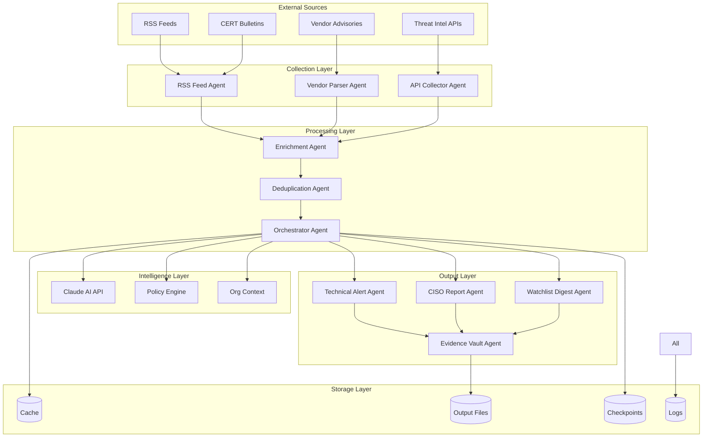

# NOMAD Architecture Overview

Comprehensive guide to the NOMAD Threat Intelligence Framework architecture and design principles.

## Table of Contents

- [System Overview](#system-overview)
- [Core Components](#core-components)
- [Agent Architecture](#agent-architecture)
- [Data Flow](#data-flow)
- [Integration Patterns](#integration-patterns)
- [Design Patterns](#design-patterns)
- [Scalability Considerations](#scalability-considerations)
- [Security Architecture](#security-architecture)

## System Overview

NOMAD (Notable Object Monitoring And Analysis Director) is a modular, AI-powered threat intelligence framework built with the following architectural principles:

### Design Philosophy
- **Agent-Based**: Modular agents with single responsibilities
- **AI-First**: Claude AI integrated at the core for intelligent processing
- **Pipeline-Driven**: Sequential and parallel processing workflows
- **Schema-Driven**: Standardized data formats throughout
- **Cloud-Native**: Designed for modern deployment patterns

### High-Level Architecture



### Technology Stack

- **Runtime**: Python 3.8+
- **AI Integration**: Anthropic Claude API
- **Configuration**: YAML + Environment Variables
- **Data Format**: JSON with schema validation
- **HTTP Client**: requests/httpx
- **RSS Processing**: feedparser
- **Caching**: File-based with optional encryption
- **Logging**: Python standard logging
- **Testing**: pytest
- **Code Quality**: black, isort, flake8, mypy

## Core Components

### 1. Base Agent Framework

All agents inherit from `BaseAgent` which provides:

```python
class BaseAgent:
    """Base class for all NOMAD agents"""

    def __init__(self, agent_name: str):
        # Environment loading
        # Logger setup
        # Claude API client initialization
        # Configuration loading

    def process_with_llm(self, input_data: Dict) -> Dict:
        # Prompt formatting
        # Claude API interaction
        # Response parsing
        # Error handling

    def run(self, **kwargs) -> Dict:
        # To be implemented by subclasses
```

### 2. Configuration Management

```python
class EnvironmentConfig:
    """Centralized configuration management"""

    # API credentials
    # File system paths
    # Organization context
    # Processing parameters
    # Security settings
```

### 3. Data Pipeline Engine

```python
class NomadWorkflow:
    """Workflow execution engine"""

    def execute_workflow(self, workflow_name: str):
        # Load workflow definition
        # Execute agents in sequence
        # Handle errors and recovery
        # Save checkpoints
```

### 4. Prompt Management System

Each agent has an associated markdown prompt file:
- `rss-agent-prompt.md`
- `orchestrator-system-prompt.md`
- `ciso-report-generator-prompt.md`

Prompts define the AI's behavior and output format.

## Agent Architecture

### Agent Types and Responsibilities

#### Collection Agents
```python
# RSS Feed Agent
class RSSFeedAgent(BaseAgent):
    def run(self, since, until, priority, source_type) -> Dict:
        # Fetch RSS feeds
        # Parse entries
        # Extract CVEs
        # Assign Admiralty ratings
        # Deduplicate items
        # Return normalized intelligence
```

#### Processing Agents
```python
# Orchestrator Agent
class OrchestratorAgent(BaseAgent):
    def run(self, input_data) -> Dict:
        # Load policy rules
        # Apply routing logic
        # Assign ownership
        # Set SLA requirements
        # Return routing decisions
```

#### Output Agents
```python
# CISO Report Agent
class CISOReportAgent(BaseAgent):
    def run(self, week_start, week_end, decisions) -> Dict:
        # Aggregate decision data
        # Generate executive summary
        # Create metrics dashboard
        # Format for leadership
        # Return formatted report
```

### Agent Lifecycle

1. **Initialization**
   - Load environment configuration
   - Initialize Claude API client
   - Load agent-specific prompt
   - Set up logging

2. **Input Validation**
   - Validate required parameters
   - Check data schemas
   - Apply input sanitization

3. **Processing**
   - Execute agent-specific logic
   - Call Claude API if needed
   - Apply business rules

4. **Output Generation**
   - Format results according to schema
   - Validate output structure
   - Save to designated location

5. **Cleanup**
   - Log execution metrics
   - Clear temporary data
   - Update checkpoints

### Agent Communication

Agents communicate through JSON files:

```python
# Agent A output becomes Agent B input
agent_a_output = {
    "agent_type": "rss",
    "timestamp": "2025-09-13T10:00:00Z",
    "intelligence": [...]
}

# File saved as: data/output/rss_feed_result_20250913_100000.json
# Agent B loads this file as input
agent_b_input = load_json("data/output/rss_feed_result_20250913_100000.json")
```

## Data Flow

### Standard Intelligence Item Schema

All intelligence items follow this standardized schema:

```json
{
  "source_type": "rss|vendor|cert|api",
  "source_name": "string",
  "source_url": "https://...",
  "title": "string",
  "summary": "string (≤60 words)",
  "published_utc": "YYYY-MM-DDTHH:MM:SSZ",
  "cves": ["CVE-YYYY-XXXX"],
  "cvss_v3": null|float,
  "cvss_v4": null|float,
  "epss": null|float,
  "kev_listed": true|false|null,
  "kev_date_added": "YYYY-MM-DD"|null,
  "exploit_status": "ITW|PoC|None|null",
  "affected_products": [
    {
      "vendor": "string",
      "product": "string",
      "versions": ["string"]
    }
  ],
  "evidence_excerpt": "string",
  "admiralty_source_reliability": "A-F",
  "admiralty_info_credibility": 1-6,
  "admiralty_reason": "string",
  "dedupe_key": "string (hash)"
}
```

### Data Transformation Pipeline

1. **Raw Data Collection** (RSS Agent)
   ```
   RSS XML → Parsed Items → CVE Extraction → Admiralty Rating
   ```

2. **Data Enrichment** (Enrichment Agent)
   ```
   Base Items → CVSS Scores → EPSS Scores → KEV Status
   ```

3. **Routing Decision** (Orchestrator)
   ```
   Enriched Items → Policy Rules → Asset Context → Route Assignment
   ```

4. **Output Generation** (Output Agents)
   ```
   Routed Items → Report Templates → Business Context → Final Reports
   ```

### Error Handling and Recovery

```python
class WorkflowValidator:
    """Validates data flow between agents"""

    def validate_agent_input(self, agent_name, input_data):
        # Schema validation
        # Required field checking
        # Data type verification

    def attempt_recovery(self, error_type, input_data):
        # API error recovery
        # Timeout handling
        # Data correction
        # Fallback strategies
```

## Integration Patterns

### Claude Code Integration

NOMAD supports two execution modes:

#### Direct Execution
```bash
python nomad_workflow_enhanced.py execute morning_check
```

#### Claude Code Orchestration
```python
Task(
    description="RSS Feed Agent",
    prompt=open("rss-agent-prompt.md").read(),
    subagent_type="general-purpose"
)
```

### External API Integration

```python
class APIIntegration:
    """Pattern for external API integration"""

    def __init__(self, api_name: str):
        self.api_key = config.get_api_key(api_name)
        self.rate_limiter = RateLimiter(api_name)
        self.cache = APICache(api_name)

    def call_api(self, endpoint: str, params: dict):
        # Check cache first
        # Apply rate limiting
        # Make API call
        # Handle errors
        # Cache response
        # Return data
```

### Workflow Engine Integration

```python
class WorkflowEngine:
    """Orchestrates agent execution"""

    def execute_workflow(self, workflow_def: Dict):
        results = {}

        for step in workflow_def['steps']:
            if step['type'] == 'agent':
                result = self._execute_agent(step)
            elif step['type'] == 'conditional':
                result = self._execute_conditional(step)
            elif step['type'] == 'parallel':
                result = self._execute_parallel(step)

            results[step['name']] = result

        return results
```

## Design Patterns

### 1. Strategy Pattern (Agent Processing)

```python
class ProcessingStrategy:
    """Strategy for different processing approaches"""

    def process(self, data: Dict) -> Dict:
        raise NotImplementedError

class LLMProcessingStrategy(ProcessingStrategy):
    def process(self, data: Dict) -> Dict:
        # Use Claude API for intelligent processing

class RuleBasedProcessingStrategy(ProcessingStrategy):
    def process(self, data: Dict) -> Dict:
        # Use predefined rules
```

### 2. Factory Pattern (Agent Creation)

```python
class AgentFactory:
    """Creates agents based on type"""

    AGENT_TYPES = {
        'rss_feed': RSSFeedAgent,
        'orchestrator': OrchestratorAgent,
        'ciso_report': CISOReportAgent
    }

    @classmethod
    def create_agent(cls, agent_type: str) -> BaseAgent:
        agent_class = cls.AGENT_TYPES.get(agent_type)
        if not agent_class:
            raise ValueError(f"Unknown agent type: {agent_type}")
        return agent_class()
```

### 3. Observer Pattern (Event Handling)

```python
class EventBus:
    """Handles events between agents"""

    def __init__(self):
        self._observers = {}

    def subscribe(self, event_type: str, callback):
        if event_type not in self._observers:
            self._observers[event_type] = []
        self._observers[event_type].append(callback)

    def publish(self, event_type: str, data: Dict):
        for callback in self._observers.get(event_type, []):
            callback(data)
```

### 4. Template Method Pattern (Agent Execution)

```python
class BaseAgent:
    """Template method for agent execution"""

    def run(self, **kwargs) -> Dict:
        # Template method defining the algorithm

        # Step 1: Validate input
        self._validate_input(kwargs)

        # Step 2: Process data (implemented by subclasses)
        result = self._process_data(kwargs)

        # Step 3: Validate output
        self._validate_output(result)

        # Step 4: Save results
        self._save_results(result)

        return result

    def _process_data(self, kwargs) -> Dict:
        # To be implemented by subclasses
        raise NotImplementedError
```

## Scalability Considerations

### Horizontal Scaling

```python
# Multiple agent instances
class AgentPool:
    """Pool of agent workers for parallel processing"""

    def __init__(self, agent_type: str, pool_size: int):
        self.agents = [AgentFactory.create_agent(agent_type)
                      for _ in range(pool_size)]

    def process_batch(self, items: List[Dict]):
        # Distribute items across agent pool
        # Process in parallel
        # Aggregate results
```

### Caching Strategy

```python
class MultiLevelCache:
    """Multi-level caching for performance"""

    def __init__(self):
        self.memory_cache = {}  # L1: In-memory
        self.file_cache = FileCache()  # L2: Disk-based
        self.shared_cache = RedisCache()  # L3: Shared cache

    def get(self, key: str):
        # Check L1 first, then L2, then L3
        # Store in higher levels on cache miss
```

### Database Abstraction

```python
class DataStore:
    """Abstract data storage interface"""

    def save_intelligence(self, items: List[Dict]):
        # Can be implemented with:
        # - File system (current)
        # - SQLite for single-node
        # - PostgreSQL for multi-node
        # - Elasticsearch for search
```

## Security Architecture

### API Key Management

```python
class SecureCredentials:
    """Secure credential management"""

    def __init__(self):
        self._credentials = self._load_encrypted_credentials()

    def get_api_key(self, service: str) -> str:
        # Decrypt and return API key
        # Rotate keys automatically
        # Log access for auditing
```

### Data Protection

```python
class DataProtection:
    """Protects sensitive data"""

    def encrypt_cache(self, data: bytes) -> bytes:
        # Encrypt cached API responses

    def sanitize_logs(self, log_entry: str) -> str:
        # Remove sensitive data from logs

    def validate_input(self, input_data: Dict) -> bool:
        # Prevent injection attacks
        # Validate data types
        # Check for malicious content
```

### Network Security

```python
class SecureHTTP:
    """Secure HTTP client wrapper"""

    def __init__(self):
        self.session = requests.Session()
        self.session.verify = True  # SSL verification
        self.session.timeout = 30   # Request timeout

    def get(self, url: str, **kwargs):
        # Validate URL
        # Apply rate limiting
        # Log request/response
        # Handle SSL errors
```

### Audit Trail

```python
class AuditLogger:
    """Security audit logging"""

    def log_api_access(self, service: str, endpoint: str):
        # Log all API calls

    def log_data_access(self, file_path: str, action: str):
        # Log file access

    def log_config_change(self, key: str, old_value: str, new_value: str):
        # Log configuration changes
```

---

## Architecture Decision Records (ADRs)

### ADR-001: Agent-Based Architecture
**Decision**: Use modular agents with single responsibilities
**Rationale**: Enables independent development, testing, and deployment
**Status**: Accepted

### ADR-002: Claude AI Integration
**Decision**: Use Anthropic Claude as primary LLM
**Rationale**: Superior reasoning capabilities for threat intelligence analysis
**Status**: Accepted

### ADR-003: File-Based Data Exchange
**Decision**: Use JSON files for agent communication
**Rationale**: Simple, debuggable, and supports checkpoint recovery
**Status**: Accepted

### ADR-004: YAML Configuration
**Decision**: Use YAML for configuration files
**Rationale**: Human-readable, supports complex data structures
**Status**: Accepted

### ADR-005: Standardized Schema
**Decision**: Enforce standardized intelligence item schema
**Rationale**: Enables interoperability and data quality validation
**Status**: Accepted

---

## Future Architecture Considerations

### Microservices Migration
```python
# Future: Convert agents to microservices
class AgentService:
    """Agent as a microservice"""

    def __init__(self, agent_type: str):
        self.agent = AgentFactory.create_agent(agent_type)
        self.app = FastAPI()

    def start_server(self):
        # Expose agent via REST API
        # Handle requests asynchronously
        # Support health checks
```

### Event Streaming
```python
# Future: Event-driven architecture
class EventStream:
    """Stream processing for real-time intelligence"""

    def process_stream(self, intelligence_stream):
        # Process intelligence items as they arrive
        # Support windowing and aggregation
        # Enable real-time alerting
```

### Cloud-Native Features
- Kubernetes deployment
- Auto-scaling based on workload
- Service mesh for communication
- Distributed tracing
- Cloud-native monitoring

---

This architecture provides a solid foundation for the NOMAD framework while remaining flexible enough to evolve with changing requirements. The modular design ensures that components can be developed, tested, and deployed independently while maintaining system coherence through standardized interfaces and data schemas.