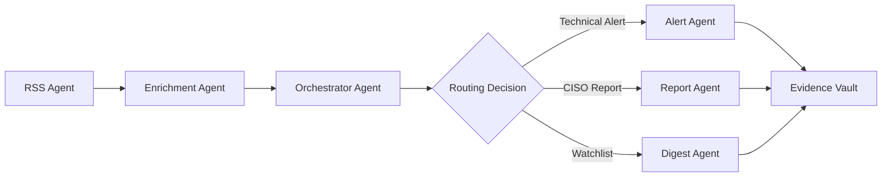

# NOMAD Workflow Guide

Master guide to creating, managing, and customizing workflows in the NOMAD Threat Intelligence Framework.

## Table of Contents

- [Workflow Fundamentals](#workflow-fundamentals)
- [Built-in Workflows](#built-in-workflows)
- [Creating Custom Workflows](#creating-custom-workflows)
- [Workflow Execution](#workflow-execution)
- [Advanced Patterns](#advanced-patterns)
- [Scheduling and Automation](#scheduling-and-automation)
- [Monitoring and Debugging](#monitoring-and-debugging)
- [Best Practices](#best-practices)

## Workflow Fundamentals

### What is a Workflow?

A workflow in NOMAD is a structured sequence of agent executions that transforms raw threat intelligence into actionable security insights. Each workflow defines:

- **Agents to Execute**: Which NOMAD agents participate
- **Execution Order**: Sequential or parallel execution patterns
- **Data Flow**: How outputs connect to inputs between agents
- **Configuration**: Agent-specific parameters and settings
- **Conditions**: When certain agents should or shouldn't run

### Workflow Components

#### Agents
- **RSS Feed Agent**: Collects raw intelligence from feeds
- **Enrichment Agent**: Adds external data (CVSS, EPSS, KEV)
- **Orchestrator Agent**: Routes intelligence based on policies
- **CISO Report Agent**: Generates executive summaries
- **Technical Alert Agent**: Creates SOC/IT team alerts
- **Watchlist Digest Agent**: Manages lower-priority items
- **Evidence Vault Agent**: Archives threat intelligence

#### Execution Patterns
- **Sequential**: Agents run one after another
- **Parallel**: Multiple agents run simultaneously
- **Conditional**: Agents run based on runtime conditions
- **Loops**: Repeat agent execution with different parameters

#### Data Flow


### Workflow Definition Format

Workflows are defined in `config/claude_agent_config.yaml`:

```yaml
workflows:
  workflow_name:
    name: "Human Readable Name"
    description: "Detailed description of workflow purpose"
    schedule: "cron_expression"  # Optional automated scheduling
    timeout_minutes: 60         # Optional execution timeout
    retry_on_failure: true      # Optional retry behavior
    steps:
      - agent: agent_name
        config:
          parameter: value
      - conditional:
          - condition: "expression"
            agent: conditional_agent
      - parallel:
          - agent: parallel_agent_1
          - agent: parallel_agent_2
```

## Built-in Workflows

### Morning Check Workflow

**Purpose**: Daily high-priority threat assessment
**Schedule**: Weekdays at 8 AM
**Duration**: 5-10 minutes

```yaml
morning_check:
  name: "Morning Security Check"
  description: "Collect and process high-priority threats from last 24 hours"
  steps:
    - agent: rss_feed
      config:
        priority: high
        since: "24 hours ago"
    - agent: enrichment
    - agent: orchestrator
    - conditional:
        - condition: "route == TECHNICAL_ALERT"
          agent: technical_alert
        - condition: "route == CISO_REPORT"
          agent: ciso_report
```

**Execution**:
```bash
# Manual execution
python nomad_workflow_enhanced.py execute morning_check

# Planning mode
python nomad_workflow_enhanced.py plan morning_check --mode=direct
```

**Expected Outputs**:
- 15-50 intelligence items processed
- 3-8 technical alerts generated
- 1-2 CISO report items
- 5-15 watchlist items

### Weekly Report Workflow

**Purpose**: Executive summary for leadership
**Schedule**: Mondays at 9 AM
**Duration**: 10-20 minutes

```yaml
weekly_report:
  name: "Weekly CISO Report"
  description: "Generate executive summary for the week"
  steps:
    - agent: rss_feed
      config:
        since: "7 days ago"
    - agent: enrichment
    - agent: orchestrator
    - agent: ciso_report
```

**Execution**:
```bash
# Current week
python nomad_workflow_enhanced.py execute weekly_report

# Custom date range
python scripts/run_ciso_report.py --week-start 2025-09-01 --week-end 2025-09-07
```

### Vendor Check Workflow

**Purpose**: Process vendor security bulletins
**Schedule**: Twice daily (patch Tuesday focus)
**Duration**: 3-8 minutes

```yaml
vendor_check:
  name: "Vendor Advisory Check"
  description: "Check specific vendor security bulletins"
  steps:
    - agent: rss_feed
      config:
        source_type: vendor
        priority: high
    - agent: vendor_parser
      optional: true
    - agent: enrichment
    - agent: orchestrator
```

### Full Pipeline Workflow

**Purpose**: Comprehensive end-to-end processing
**Schedule**: Daily at midnight
**Duration**: 15-30 minutes

```yaml
full_pipeline:
  name: "Full NOMAD Pipeline"
  description: "Complete threat intelligence processing pipeline"
  steps:
    - agent: rss_feed
    - agent: enrichment
    - agent: orchestrator
    - parallel:
        - agent: technical_alert
          condition: "route == TECHNICAL_ALERT"
        - agent: ciso_report
          condition: "route == CISO_REPORT"
        - agent: watchlist_digest
          condition: "route == WATCHLIST"
    - agent: evidence_vault
```

## Creating Custom Workflows

### Custom Workflow Examples

#### Incident Response Workflow
```yaml
incident_response:
  name: "Incident Response Intelligence"
  description: "Rapid threat intelligence for active incidents"
  timeout_minutes: 30
  steps:
    - agent: rss_feed
      config:
        since: "72 hours ago"
        priority: high
        source_type: all
    - agent: enrichment
      config:
        deep_analysis: true
        include_iocs: true
    - agent: orchestrator
      config:
        emergency_mode: true
        lower_thresholds: true
    - parallel:
        - agent: technical_alert
          config:
            priority_override: critical
        - agent: evidence_vault
          config:
            preserve_all: true
```

#### Threat Hunting Workflow
```yaml
threat_hunting:
  name: "Weekly Threat Hunting Intelligence"
  description: "Collect intelligence for proactive hunting"
  steps:
    - agent: rss_feed
      config:
        source_type: research
        since: "7 days ago"
        include_iocs: true
    - agent: enrichment
      config:
        include_tactics: true
        include_techniques: true
    - parallel:
        - agent: ioc_extractor
        - agent: ttp_mapper
    - agent: hunting_report
```

#### Vulnerability Management Workflow
```yaml
vuln_management:
  name: "Vulnerability Management Focus"
  description: "CVE-focused intelligence processing"
  steps:
    - agent: rss_feed
      config:
        cve_filter_only: true
        source_type: [vendor, cert]
        priority: [high, medium]
    - agent: enrichment
      config:
        mandatory_fields: [cvss_v3, epss, kev_status]
    - agent: vuln_prioritizer
      config:
        asset_mapping: true
        business_impact: true
    - agent: patch_tracker
```

### Workflow Configuration Parameters

#### Agent-Level Configuration
```yaml
steps:
  - agent: rss_feed
    config:
      # Time parameters
      since: "24 hours ago"
      until: "now"

      # Filtering
      priority: high
      source_type: vendor

      # Processing options
      max_items: 100
      include_low_confidence: false

      # Output options
      save_intermediate: true
      verbose_logging: true

    # Execution options
    timeout_minutes: 15
    retry_count: 3
    continue_on_failure: false
```

#### Conditional Logic
```yaml
- conditional:
    # Simple conditions
    - condition: "route == TECHNICAL_ALERT"
      agent: technical_alert

    # Complex conditions
    - condition: "cvss_v3 >= 9.0 AND asset_exposure == 'Internet-facing'"
      agent: emergency_alert

    # Multiple conditions (OR logic)
    - condition: "kev_listed == true OR epss >= 0.9"
      agent: priority_alert

    # Asset-based routing
    - condition: "affected_systems.contains('Exchange')"
      agent: email_security_alert
```

#### Parallel Execution
```yaml
- parallel:
    # Independent agents
    - agent: technical_alert
      condition: "route == TECHNICAL_ALERT"
    - agent: ciso_report
      condition: "route == CISO_REPORT"

    # Resource-aware execution
    max_concurrent: 3
    wait_for_completion: true

    # Failure handling
    fail_fast: false
    required_successes: 2
```

### Advanced Workflow Patterns

#### Multi-Stage Processing
```yaml
advanced_analysis:
  name: "Multi-Stage Threat Analysis"
  steps:
    # Stage 1: Collection
    - stage: collection
      parallel:
        - agent: rss_feed
          config:
            source_type: vendor
        - agent: rss_feed
          config:
            source_type: cert
        - agent: api_collector

    # Stage 2: Enrichment
    - stage: enrichment
      agent: enrichment
      config:
        input_sources: all_previous

    # Stage 3: Analysis
    - stage: analysis
      parallel:
        - agent: malware_analysis
        - agent: campaign_tracker
        - agent: attribution_engine
```

#### Error Recovery Workflow
```yaml
resilient_processing:
  name: "Error-Resilient Processing"
  retry_on_failure: true
  max_retries: 3
  steps:
    - agent: rss_feed
      fallback:
        - agent: cached_feed_reader
        - agent: backup_source_collector

    - agent: enrichment
      timeout_minutes: 10
      fallback:
        - agent: basic_enrichment

    - agent: orchestrator
      required: true  # Must succeed
```

#### Dynamic Workflow Generation
```yaml
adaptive_collection:
  name: "Adaptive Intelligence Collection"
  steps:
    - agent: threat_landscape_analyzer
      outputs: [current_threats, emerging_campaigns]

    - dynamic_step:
        condition: "current_threats.count > 10"
        generate:
          - agent: rss_feed
            config:
              keywords: "{{current_threats.keywords}}"

    - conditional:
        - condition: "emerging_campaigns.detected"
          workflow: incident_response
```

## Workflow Execution

### Execution Modes

#### Interactive Execution (Claude Code)
```bash
# Generate Claude Code instructions
python nomad_workflow_enhanced.py plan morning_check --mode=claude_code
```

Then use in Claude Code:
```python
Task(
    description="RSS Feed Agent",
    prompt=open("rss-agent-prompt.md").read(),
    subagent_type="general-purpose"
)
```

#### Automated Execution (Direct)
```bash
# Execute complete workflow
python nomad_workflow_enhanced.py execute morning_check

# Dry run (planning only)
python nomad_workflow_enhanced.py plan morning_check --mode=direct

# Verbose execution
LOG_LEVEL=DEBUG python nomad_workflow_enhanced.py execute morning_check
```

#### Manual Step-by-Step
```bash
# Execute individual agents
python scripts/run_rss_agent.py --priority high --use-llm
python scripts/run_orchestrator.py --input data/output/rss_feed_result_*.json
python scripts/run_ciso_report.py --decisions data/output/orchestrator_result_*.json
```

### Execution Monitoring

#### Real-Time Progress
```bash
# Monitor execution with live updates
python nomad_workflow_enhanced.py execute morning_check --progress

# Monitor with metrics
python nomad_workflow_enhanced.py execute morning_check --metrics
```

#### Execution Logs
```bash
# View execution logs
tail -f data/logs/workflow_execution_$(date +%Y%m%d).log

# Agent-specific logs
tail -f data/logs/rss_agent_$(date +%Y%m%d).log
```

#### Checkpoint Management
```bash
# View available checkpoints
ls data/checkpoints/morning_check_*

# Resume from checkpoint
python nomad_workflow_enhanced.py resume morning_check --from-step 2
```

## Advanced Patterns

### Workflow Composition

#### Nested Workflows
```yaml
master_workflow:
  name: "Master Intelligence Processing"
  steps:
    - workflow: morning_check
    - workflow: vendor_check
      condition: "morning_check.technical_alerts > 5"
    - workflow: threat_hunting
      condition: "high_threat_day"
```

#### Workflow Templates
```yaml
# Template definition
intelligence_template:
  template: true
  parameters:
    - name: source_priority
      default: high
    - name: time_range
      default: "24 hours ago"
    - name: focus_area
      required: true

  steps:
    - agent: rss_feed
      config:
        priority: "{{source_priority}}"
        since: "{{time_range}}"
        keywords: "{{focus_area}}"

# Template usage
ransomware_intelligence:
  extends: intelligence_template
  parameters:
    focus_area: "ransomware"
    source_priority: high
```

### Data Pipeline Patterns

#### Fan-Out Processing
```yaml
multi_output:
  steps:
    - agent: rss_feed
    - parallel:
        - agent: soc_processor
          config:
            output_format: soc_alerts
        - agent: vuln_processor
          config:
            output_format: vuln_reports
        - agent: executive_processor
          config:
            output_format: executive_brief
```

#### Aggregation Pattern
```yaml
intelligence_fusion:
  steps:
    - parallel:
        - agent: osint_collector
        - agent: commercial_feeds
        - agent: vendor_advisories
    - agent: correlation_engine
      config:
        inputs: all_previous
    - agent: fusion_analyzer
```

### Event-Driven Workflows

#### Trigger-Based Execution
```yaml
event_driven:
  triggers:
    - event: high_severity_cve
      condition: "cvss >= 9.0"
      workflow: emergency_response

    - event: kev_addition
      condition: "new_kev_item"
      workflow: kev_analysis

    - event: apt_campaign
      condition: "campaign_detected"
      workflow: campaign_tracker
```

#### Webhook Integration
```yaml
webhook_workflows:
  webhooks:
    - endpoint: "/api/v1/threat-alert"
      method: POST
      workflow: immediate_response
      auth: api_key

    - endpoint: "/api/v1/bulk-intel"
      method: POST
      workflow: bulk_processor
      rate_limit: 10/minute
```

## Scheduling and Automation

### Cron-based Scheduling

#### Schedule Configuration
```yaml
workflows:
  morning_check:
    schedule: "0 8 * * 1-5"  # Weekdays at 8 AM
    timezone: "America/New_York"

  weekly_report:
    schedule: "0 9 * * 1"    # Mondays at 9 AM

  vendor_check:
    schedule: "0 */6 * * *"  # Every 6 hours

  full_pipeline:
    schedule: "0 2 * * *"    # Daily at 2 AM
```

#### Crontab Integration
```bash
# Add to system crontab
0 8 * * 1-5 cd /path/to/nomad && python nomad_workflow_enhanced.py execute morning_check
0 9 * * 1   cd /path/to/nomad && python nomad_workflow_enhanced.py execute weekly_report
0 */6 * * * cd /path/to/nomad && python nomad_workflow_enhanced.py execute vendor_check
```

### Systemd Service Management

#### Service Definition
```ini
# /etc/systemd/system/nomad-scheduler.service
[Unit]
Description=NOMAD Workflow Scheduler
After=network.target

[Service]
Type=simple
User=nomad
WorkingDirectory=/opt/nomad-threat-intel-framework
ExecStart=/opt/nomad/venv/bin/python scheduler.py
Restart=always
RestartSec=10

[Install]
WantedBy=multi-user.target
```

#### Service Management
```bash
# Enable and start service
sudo systemctl enable nomad-scheduler
sudo systemctl start nomad-scheduler

# Monitor service
sudo systemctl status nomad-scheduler
sudo journalctl -u nomad-scheduler -f
```

### Advanced Scheduling

#### Conditional Scheduling
```yaml
smart_scheduling:
  morning_check:
    schedule: "0 8 * * 1-5"
    conditions:
      - not_holiday
      - office_hours
      - threat_level_normal

  emergency_check:
    triggers:
      - threat_level_elevated
      - incident_declared
    immediate: true
```

#### Resource-Aware Scheduling
```yaml
resource_management:
  high_priority_workflows:
    - morning_check
    - incident_response

  resource_limits:
    max_concurrent_workflows: 3
    memory_limit_mb: 2048
    cpu_limit_percent: 80

  queue_management:
    priority_queue: true
    timeout_minutes: 30
    retry_failed: true
```

## Monitoring and Debugging

### Workflow Monitoring

#### Execution Metrics
```bash
# View workflow metrics
python src/utils/workflow_metrics.py --workflow morning_check --days 7

# Performance analysis
python src/utils/performance_analyzer.py --analyze-all
```

#### Health Checks
```bash
# Validate workflow definitions
python src/utils/workflow_validator.py config/claude_agent_config.yaml

# Test workflow connectivity
python src/utils/workflow_tester.py --workflow morning_check --dry-run
```

#### Alerting and Notifications
```yaml
monitoring:
  alerts:
    - condition: "execution_time > 30_minutes"
      notification: slack_channel

    - condition: "failure_rate > 10%"
      notification: email_admin

    - condition: "no_intelligence_items"
      notification: soc_team
```

### Debugging Workflows

#### Debug Mode Execution
```bash
# Debug mode with detailed logging
DEBUG=1 python nomad_workflow_enhanced.py execute morning_check

# Step-by-step debugging
python nomad_workflow_enhanced.py debug morning_check --step-by-step

# Interactive debugging
python nomad_workflow_enhanced.py debug morning_check --interactive
```

#### Common Issues and Solutions

**Workflow Won't Start**:
```bash
# Check configuration
python src/utils/config_validator.py

# Verify agent availability
python src/utils/agent_health.py --check-all

# Review prerequisites
python src/utils/dependency_checker.py
```

**Agent Timeouts**:
```bash
# Increase timeout in workflow config
timeout_minutes: 30

# Check API connectivity
python src/utils/api_tester.py

# Monitor resource usage
htop
```

**Data Flow Issues**:
```bash
# Validate data schemas
python src/utils/schema_validator.py data/output/rss_feed_result_*.json

# Check file permissions
ls -la data/output/

# Review agent logs
tail -f data/logs/orchestrator_*.log
```

### Performance Optimization

#### Workflow Tuning
```yaml
performance_optimization:
  rss_feed:
    parallel_feeds: 5
    timeout_per_feed: 30
    cache_responses: true

  orchestrator:
    batch_size: 50
    parallel_processing: true

  ciso_report:
    template_caching: true
    incremental_updates: true
```

#### Resource Monitoring
```bash
# Monitor memory usage
python src/utils/memory_monitor.py --workflow morning_check

# Track API usage
python src/utils/api_usage_tracker.py --report daily

# Analyze bottlenecks
python src/utils/bottleneck_analyzer.py --workflow full_pipeline
```

## Best Practices

### Workflow Design

#### Design Principles
1. **Single Responsibility**: Each workflow should have a clear, focused purpose
2. **Idempotency**: Workflows should produce consistent results when re-run
3. **Error Tolerance**: Handle failures gracefully with appropriate fallbacks
4. **Scalability**: Design for future growth in data volume and complexity
5. **Maintainability**: Use clear naming and comprehensive documentation

#### Configuration Management
```yaml
# Good: Clear, specific configuration
morning_security_briefing:
  name: "Morning Security Briefing for SOC Team"
  description: "Collect high-priority threats from past 24 hours, focusing on KEV-listed vulnerabilities and active exploitation"

# Avoid: Vague, unclear configuration
daily_run:
  name: "Daily Run"
  description: "Get stuff"
```

#### Error Handling Strategy
```yaml
robust_workflow:
  steps:
    - agent: rss_feed
      timeout_minutes: 10
      retry_count: 3
      fallback:
        - agent: cached_feed_reader

    - agent: enrichment
      continue_on_failure: true
      fallback:
        - agent: basic_enrichment

    - agent: orchestrator
      required: true  # Must succeed for workflow to continue
```

### Operational Excellence

#### Testing Strategy
```bash
# Test workflows before production deployment
python nomad_workflow_enhanced.py plan new_workflow --mode=direct
python nomad_workflow_enhanced.py execute new_workflow --dry-run

# Validate with sample data
python src/utils/workflow_tester.py --sample-data test_data.json
```

#### Documentation Requirements
- **Purpose**: Clear statement of workflow objectives
- **Dependencies**: Required feeds, APIs, and configurations
- **Outputs**: Expected results and file locations
- **SLA**: Execution time expectations and failure handling
- **Contacts**: Responsible teams and escalation procedures

#### Version Control
```bash
# Track workflow changes
git add config/claude_agent_config.yaml
git commit -m "Add incident response workflow for Q4 threat landscape"

# Tag releases
git tag -a v1.2-workflows -m "Updated workflows for winter 2025"
```

#### Change Management
1. **Development**: Test new workflows in dev environment
2. **Staging**: Validate with production-like data
3. **Production**: Deploy during maintenance windows
4. **Monitoring**: Track metrics for first 48 hours
5. **Rollback**: Maintain previous version for quick reversion

---

## Workflow Examples by Industry

### Financial Services
```yaml
financial_compliance:
  name: "Financial Services Compliance Check"
  schedule: "0 */4 * * *"  # Every 4 hours
  steps:
    - agent: rss_feed
      config:
        source_type: [cert, vendor]
        keywords: [payment, financial, banking, PCI]
    - agent: compliance_mapper
    - agent: risk_assessor
    - agent: regulatory_reporter
```

### Healthcare
```yaml
healthcare_security:
  name: "Healthcare Security Monitoring"
  steps:
    - agent: rss_feed
      config:
        keywords: [medical, healthcare, HIPAA, patient]
    - agent: medical_device_scanner
    - agent: phi_impact_assessor
    - agent: healthcare_alert_generator
```

### Manufacturing
```yaml
industrial_security:
  name: "Industrial Control System Security"
  steps:
    - agent: rss_feed
      config:
        keywords: [SCADA, PLC, industrial, manufacturing, OT]
    - agent: ics_threat_analyzer
    - agent: operational_impact_assessor
    - agent: safety_alert_generator
```

---

## Next Steps

To master NOMAD workflows:

1. **🚀 Start Simple**: Begin with built-in workflows, then customize
2. **📊 Monitor Results**: Track workflow performance and adjust
3. **🔄 Iterate**: Continuously improve based on team feedback
4. **📖 Review [Troubleshooting](troubleshooting.md)** for common workflow issues
5. **🛠️ Explore [Developer Guide](../developer-guide/)** for advanced customization